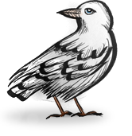

<h2 align="center">Git</h2>

 
 
 

 
 

<h2 align="center">🛠 Skills and Tools</h2>

<code></code>
<code></code>
<code></code>
<code></code>
<code></code>
<code></code>
<code></code>
<code></code>

 
 

